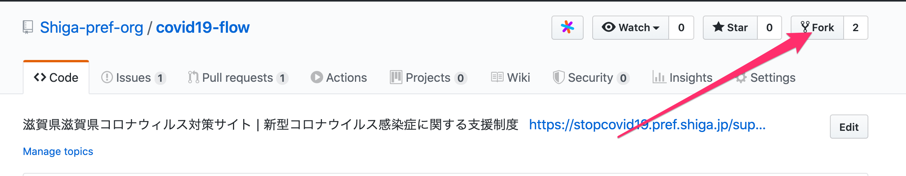
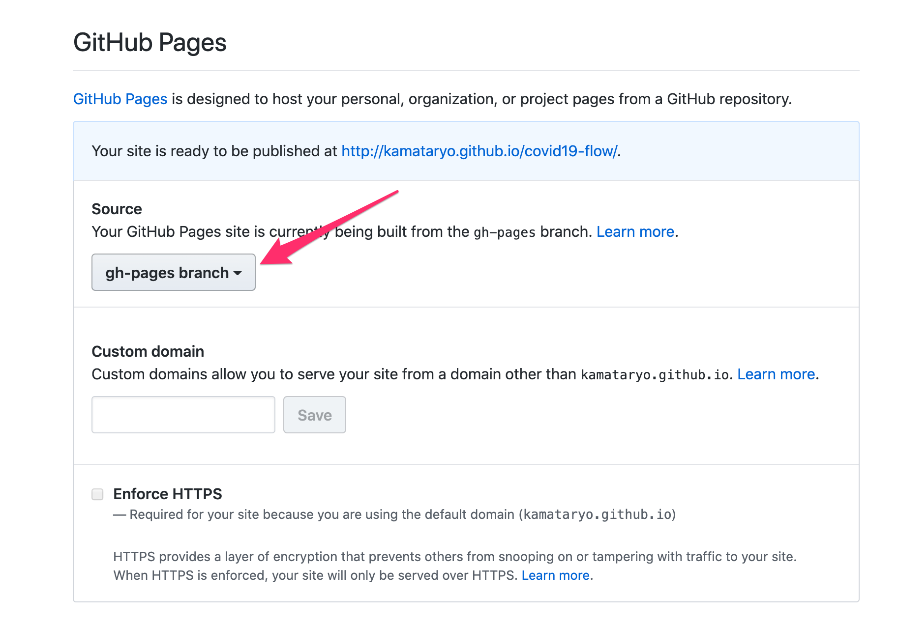
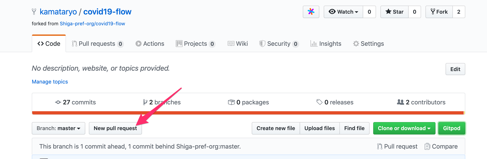
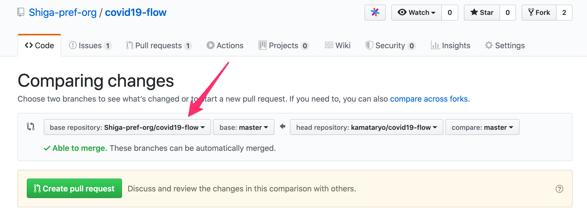

# COVID19-flow

preview: https://shiga-pref.github.io/covid19-flow/

## develop

```shell
$ npm install
$ npm run build # テンプレートから HTML を生成
$ npm start     # 生成した HTML をブラウザで表示
```

## Contribution

1. リポジトリをフォーク

    

2. 修正をコミットしてプッシュ

    ```shell
    # シェルから
    $ git add .
    $ git commit -m"Some fix"
    $ git push origin master
    ```

    Gitpod を使う場合は以下のような URL を開くと開発環境を起動できます。

    `https://gitpod.io/#https://github.com/<GitHub のユーザー名>/covid19-flow`

3. GitHub Pages を有効にしてプレビュー。

    

    以下のような URL でプレビューができるようになります。

    `https://<GitHub のユーザー名>.github.io/covid19-flow/support01_01.html`

4. プルリクエストを作成

    フォークしたあなたのアカウントから、滋賀県（Shiga-pref-org）アカウントへプルリクエストを作成します。

    

    
